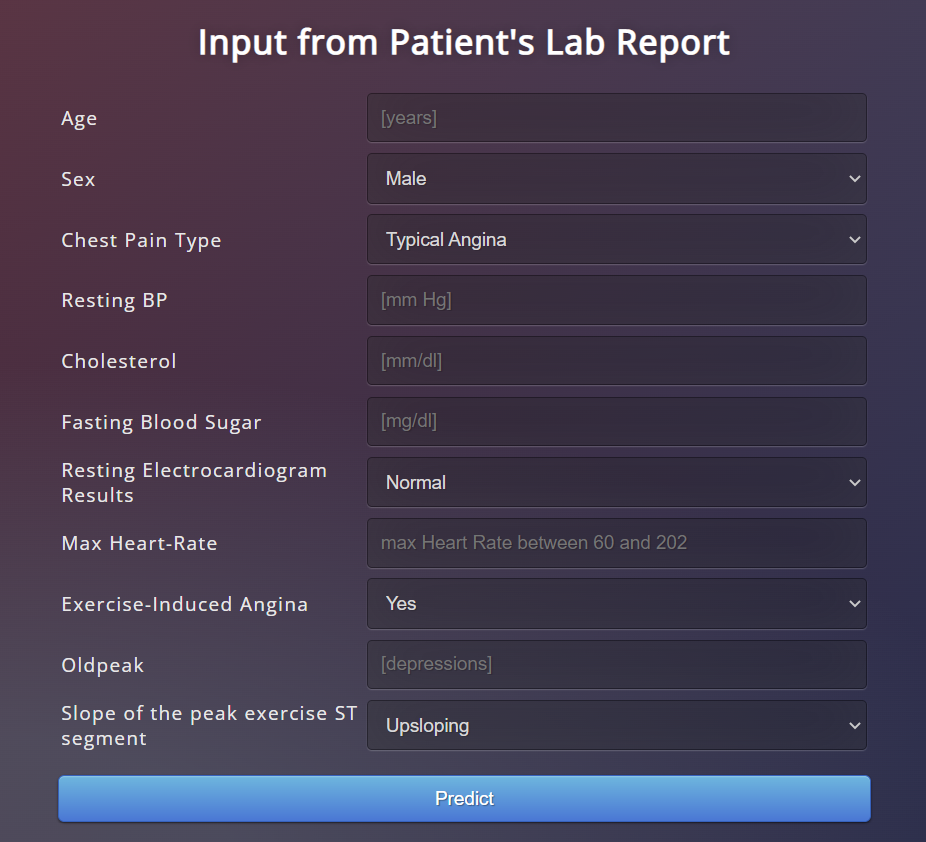

# **Heart Failure Prediction**
This is our final group project for PRML Course on complete Machine Learning Pipeline implementation. We implemented a model using ensemble techniques which combines the predictions from five different models : LightGBM, Random Forest, XGBoost, Gradient Boosting and Gaussian Naïve Bayes.

> Dataset : [heart failure dataset](https://www.kaggle.com/datasets/fedesoriano/heart-failure-prediction)

> Deployed Website : [link](https://heart-failure-pred0.herokuapp.com)

## **Model Deployment**

### Prerequisites
You must have following packages installed :
1. sklearn
2. pandas
3. numpy
4. gunicorn
5. matplotlib
6. xgboost
7. lightgbm
7. Flask

### Deployment Structure
It has three major parts :
1. model.py - This contains code for our Machine Learning model to predict heart failure based on data in 'heart.csv' file.
2. app.py - This contains Flask APIs that receives employee details through GUI or API calls, computes the precited value based on our model and returns it.
3. templates - This folder contains the HTML template to allow user to enter patient details and displays the predicted heart failure probability.

Our final Model is in ENSEMBLE.py file

### Running the project

1. Ensure that you are in the project home directory. Create the machine learning model by running below command -
```
python model.py
```
This would create a serialized version of our model into a file model.pkl

2. Run app.py using below command to start Flask API
```
python app.py
```
By default, flask will run on port 5000.

3. Navigate to URL http://localhost:5000

You should be able to view the homepage as below :


Enter valid numerical values in all 11 input boxes in following format:

* Age : age of the patient [float]
* Sex : sex of the patient [M: Male, F: Female]
* ChestPainType : chest pain type [TA: Typical Angina, ATA: Atypical Angina, NAP: Non-Anginal Pain, ASY: Asymptomatic]
* RestingBP : resting blood pressure [float : mm Hg]
* Cholesterol : serum cholesterol [float : mm/dl]
* FastingBS : fasting blood sugar [float : mg/dl]
* RestingECG : resting electrocardiogram results [Normal: Normal, ST: having ST-T wave abnormality (T wave inversions and/or ST elevation or depression of > 0.05 mV), LVH: showing probable or definite left ventricular hypertrophy by Estes' criteria]
* MaxHR : maximum heart rate achieved [Integer value between 60 and 202]
* ExerciseAngina : exercise-induced angina [Y: Yes, N: No]
* Oldpeak : oldpeak = ST [float value measured in depression]
* ST_Slope : the slope of the peak exercise ST segment [Up: upsloping, Flat: flat, Down: downsloping]

Now hit the Predict button.
If everything goes well, you should  be able to see the following output on the HTML page!


> Note : These steps are for deployment of model on localhost. You can also use Procfile to host it on Heroku Server.
